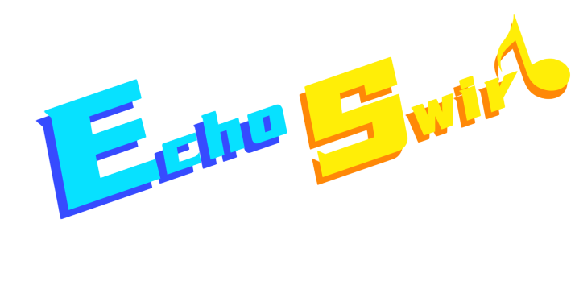

# Echo Swirl

Echo Swirl is an entry for a game jam named [CUSGA2024](https://www.ciga.me/cusga), which mixes the mechanics of a rhythm game and a 2d-platform game.

In other terms, it's also a project for me to practice game development with Unity and some code design patterns.

# Status

This project is still in development and unfinished.

# License

This project is licensed under the MIT License, which allows modification according to specific project requirements (such as resource encryption) without the need for re-licensing.